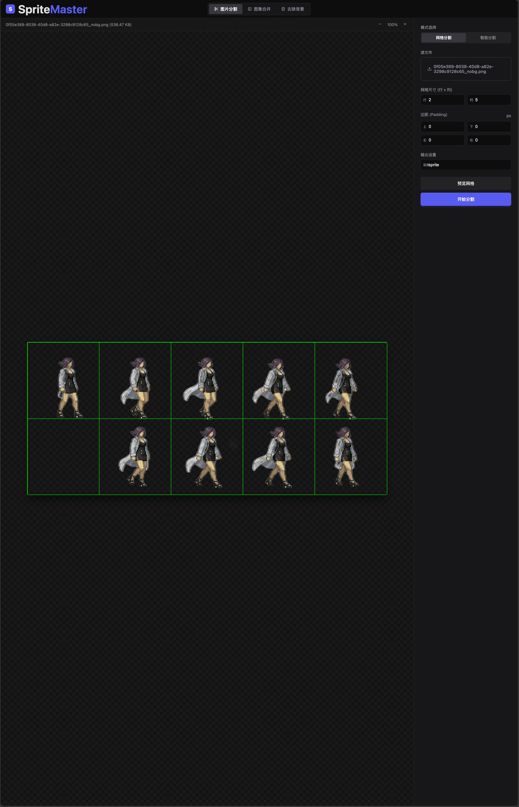
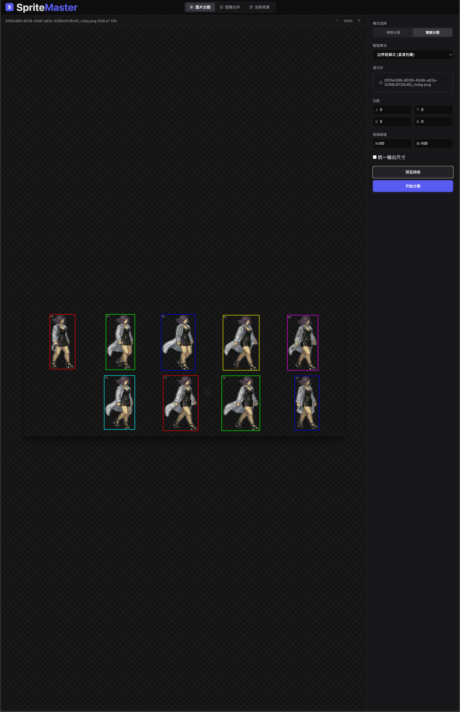
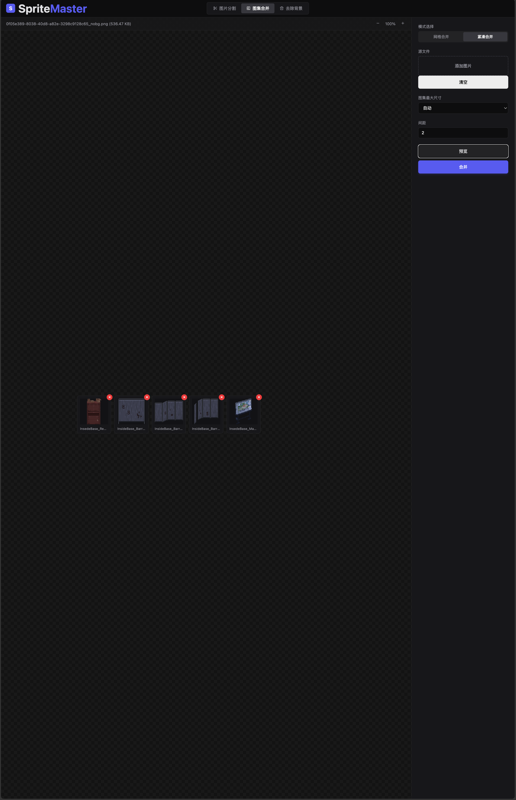
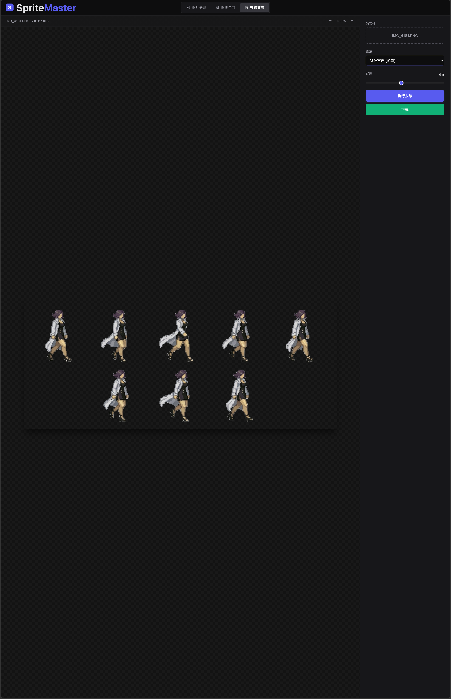

# SpriteMaster - 图片分割与图集合并工具

一个基于 Flask + 原生前端的 Web 图片处理工具，支持将图集分割为独立图片，将多张图片合并为一张图集，以及智能边界检测和背景去除功能。非常方便用于ai生成的精灵图集的处理。

## 功能特性

### 图片分割
- 网格分割：支持设置上、下、左、右边距，自定义行列数
- 智能分割：自动检测精灵边界，支持不规则网格
- 边界检测：自动识别图集中的独立精灵
- 实时预览分割网格
- 一键下载分割后的图片

### 图集合并
- 规则合并：自定义行列数、单元格尺寸
- 紧凑合并：自动排列图片，最小化图集尺寸
- 支持透明背景
- 可设置单元格间距
- 实时预览合并结果

### 背景去除
- 颜色去除：去除指定颜色的背景
- 吸管取色：点击图片选择要去除的颜色
- 容差调节：控制颜色匹配精度

### 缓存管理
- 自动清除一天前的缓存文件
- 防止磁盘空间占用过大

## 界面预览

### 网格分割预览


### 智能边界分割


### 图集合并


### 背景去除


## 部署环境

- **Python**: Python 3.7 或更高版本

## 安装

1. 确保已安装 Python 3.7+

2. 安装依赖：
```bash
pip install -r requirements.txt
```

## 使用方法

### 1. 启动程序

**一键启动（推荐）：**

| 平台 | 操作 |
|------|------|
| Windows | 双击 `start-windows.bat` 文件 |
| macOS | 双击 `start-mac.command` 文件 |
| Linux | 双击 `start-linux.sh` 文件，或在终端运行 `./start-linux.sh` |

**手动启动：**

```bash
# 启动后端（默认端口 8000，端口占用时自动递增）
cd backend
python app.py

# 启动前端（默认端口 8080，端口占用时自动递增）
cd frontend
python -m http.server 8080
```

然后在浏览器中访问: http://localhost:8080

---

### 2. 图片分割（网格模式）

1. 切换到「图片分割」选项卡
2. 点击「选择图片」上传要分割的图集
3. 设置分割参数：
   - **行数**：图集的行数
   - **列数**：图集的列数
   - **边距**：上下左右需要裁剪的像素
   - **文件名前缀**：输出文件的前缀名称
4. 点击「预览分割」查看分割网格
5. 点击「开始分割」执行分割
6. 在结果区域下载分割后的图片

---

### 3. 智能分割（自动检测边界）

1. 切换到「智能分割」选项卡
2. 上传图集图片
3. 设置检测参数（阈值、最小间距等）
4. 点击「自动检测」识别精灵边界
5. 调整检测结果的分割线
6. 执行分割并下载

---

### 4. 图集合并

1. 切换到「图集合并」选项卡
2. 点击「选择图片」上传要合并的多张图片
3. 选择合并模式：
   - **规则合并**：设置行列数和单元格尺寸
   - **紧凑合并**：自动排列，节省空间
4. 点击「预览合并」查看合并效果
5. 点击「开始合并」执行合并
6. 下载合并后的图片

---

### 5. 背景去除

1. 切换到「背景去除」选项卡
2. 上传需要处理的图片
3. 选择去除方式：
   - **颜色去除**：去除四角像素颜色
   - **吸管取色**：点击图片选择要去除的颜色
4. 调整容差值
5. 预览效果并下载
